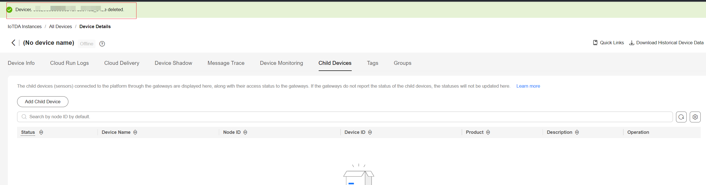

[English](./README_EN.md) | 简体中文

# huaweicloud-iot-device-sdk-java

huaweicloud-iot-device-sdk-java提供设备接入华为云IoT物联网平台的Java版本的SDK，提供设备和平台之间通讯能力，以及设备服务、网关服务、OTA等高级服务，并且针对各种场景提供了丰富的demo代码。IoT设备开发者使用SDK可以大大简化开发复杂度，快速的接入平台。

# 0.版本更新说明

| 版本号 | 变更类型 | 说明                                                         |
| ------ | -------- | ------------------------------------------------------------ |
| 1.2.1  | 新增功能 | OTA升级支持网关模式，端侧规则                                |
| 1.2.0  | 新增功能 | 新增泛协议、国密算法、OBS升级包功能                          |
|        | 功能增强 | 1、BootstrapClient构造方法传入平台根CA证书方式优化，原有构造方法标为已废弃；<br/>2、更新Samples中的ca.jks为包含平台各区域实例设备侧证书的所有权威根CA证书的证书文件；<br/>3、修复部分拼写错误;<br>4、paho升级;<br/>5、修复退避重连长时间后不再重试问题 |
| 1.1.2  | 功能增强 | 修改发放功能问题、兼容多region不同证书场景等                 |
| 1.0.1  | 新功能   | 增加隐式订阅接口、数据压缩上报接口等等                       |
| 1.0.0  | 功能增强 | 1、修改兼容V3旧接口逻辑<br/>2、网关刷新子设备状态<br/>3、修改默认订阅topic的qos、修改重连新链路挤老链路、修改重连时间 |
| 0.8.0  | 功能增强 | 更换新的接入域名（iot-mqtts.cn-north-4.myhuaweicloud.com）和根证书。<br/>如果设备使用老域名（iot-acc.cn-north-4.myhuaweicloud.com）接入，请使用 v0.6.0及以下版本的SDK |
| 0.6.0  | 功能增强 | 调整OTA服务使用方式；完善md                                  |
| 0.5.0  | 新增功能 | 提供对接华为云物联网平台能力，方便用户实现接入、设备管理、命令下发等业务场景 |

# 1.前言
huaweicloud-iot-device-sdk-java提供设备接入华为云IoT物联网平台的Java版本的SDK，提供设备和平台之间通讯能力，以及设备服务、网关服务、OTA等高级服务，并且针对各种场景提供了丰富的demo代码。IoT设备开发者使用SDK可以大大简化开发复杂度，快速的接入平台。

# 2.SDK简介

## 2.1 功能支持
SDK面向运算、存储能力较强的嵌入式终端设备，开发者通过调用SDK接口，便可实现设备与物联网平台的上下行通讯。SDK当前支持的功能有： 

| 功能                         | 描述说明                                                     |
| ---------------------------- | :----------------------------------------------------------- |
| [设备初始化](#3.0)           | 作为客户端使用MQTT协议接入到华为云平台。分为密钥认证和证书认证两种认证方式。 |
| [自定义选项](#3.1)           | 自定义选项提供配置自定义断线重连、离线最大缓存消息数量、正在传输但还未收到确认的消息数量、连接状态监听器功能。 |
| [断线重连](#3.2)             | 设备连接失败或网络不稳定等原因导致被动断开连接时，会进行一个重连操作。 |
| [消息上报、下发](#3.3)       | 消息上报用于设备将自定义数据上报给平台，平台将设备上报的消息转发给应用服务器或华为云其他云服务上进行存储和处理，消息下发用于平台向设备下发消息，设备对收到的消息进行处理。 |
| [属性上报、设置、查询](#3.4) | 属性上报用于设备按产品模型中定义的格式将属性数据上报给平台。属性设置用于平台设置设备属性。设备收到属性设置请求后，需要将执行结果返回给平台。属性查询用于平台查询设备的属性，设备收到属性查询请求后，需要将设备的属性数据返回给平台 |
| [命令下发](#3.5)             | 用于平台向设备下发设备控制命令。平台下发命令后，需要设备及时将命令的执行结果返回给平台。 |
| [获取设备影子](#3.6)         | 用于设备向平台获取设备影子数据。                             |
| [软固件（OTA）升级](#3.7)    | 用于与平台配合下载OTA升级包。                                |
| [时间同步](#3.8)             | 设备向平台发起时间同步请求。                                 |
| [网关与子设备](#3.9)         | 网关设备：通过平台支持的协议，直接连接到平台的设备。子设备：针对未实现TCP/IP协议栈的设备，由于无法直接同物联网平台通信，它需要通过网关进行数据转发。当前仅支持通过mqtt协议直连到平台的设备作为网关设备。 |
| [文件上传、下载](#3.10)      | 华为物联网平台支持设备将运行日志，配置信息等文件上传至平台，便于用户进行日志分析、故障定位、设备数据备份等。当设备采用HTTPS方式将文件上传到OBS服务进行备份时，您可以在OBS服务管理已上传的设备文件。 |
| [端侧规则](#3.11)            | 通过条件触发，基于预设的规则，引发多设备的协同反应，实现设备联动、智能控制。目前物联网平台支持两种联动规则：云端规则和端侧规则。 |
| [设备发放](#3.12)            | 分为证书认证、密钥认证。主要用于分发到不同局点、实例的场景，动态完成不同批次设备初始化配置。 |
| [面向物模型编程](#3.13)      | 面向物模型编程指的是，基于SDK提供的物模型抽象能力，设备代码只需要按照物模型定义设备服务，SDK就能自动的和平台通讯，完成属性的同步和命令的调用。<br/>相比直接调用客户端接口和平台进行通讯，面向物模型编程简化了设备侧代码的复杂度，让设备代码只需要关注业务，而不用关注和平台的通讯过程。 |
| [泛协议接入](#3.14)          | 当非HTTP、MQTT、LWM2M等第三方协议接入时，需要在平台外部完成协议转换。推荐使用网关来完成协议转换，将第三方协议转成MQTT协议。 |


# 3.SDK功能

依赖的版本：
* JDK ：1.8 +


<h2  id  =  "3.0">3.0 设备初始化</h2>
创建设备并初始化，当前已支持国密通信
启用国密前请参考[BGMProvider安装指南](https://gitee.com/openeuler/bgmprovider/wikis/%E4%B8%AD%E6%96%87%E6%96%87%E6%A1%A3/BGMProvider%E5%AE%89%E8%A3%85%E6%8C%87%E5%8D%97)进行配置


- 设备密钥认证：
```java
// 用户请替换为自己的接入地址。
IoTDevice device = new IoTDevice("ssl://xxx.st1.iotda-device.cn-north-4.myhuaweicloud.com:8883", "5e06bfee334dd4f33759f5b3_demo", "mysecret", file);
//默认使用国际加密通信，若要使用国密通信可setGmssl为true
//device.getClient().getClientConf().setGmssl(true);
//默认使用不校验时间戳，若要校验则设置对应的参数选择密钥加密算法
//device.getClient().getClientConf().setCheckStamp(Constants.CHECK_STAMP_SM3_ON);
if (device.init() != 0) {
    return;
}
```
- 设备证书认证：
华为物联网平台支持设备使用自己的X.509证书进行设备接入认证。证书制作上传请参考：[X.509证书认证](https://support.huaweicloud.com/usermanual-iothub/iot_01_0055.html)。接入步骤请参考：

首选读取证书，如果是pem格式的证书：

 ```java
KeyStore keyStore = DemoUtil.getKeyStore("D:\\SDK\\cert\\deviceCert.pem", "D:\\SDK\\cert\\deviceCert.key", "keypassword");
 ```
如果是keystore格式证书：
```java
KeyStore keyStore = KeyStore.getInstance(KeyStore.getDefaultType());keyStore.load(new FileInputStream("D:\\SDK\\cert\\my.keystore"), "keystorepassword".toCharArray());
```
如果是国密场景下的设备接入，需要导入双证书：
```java
KeyStore keyStore = KeyStore.getInstance(KeyStore.getDefaultType());
keyStore.load(null, null);
GmCertificate gmSignCert = new GmCertificate("gm-sig-certificate", "D:\\devicecert\\gmcert_s\\CS.cert.pem",
          "gm-sig-private-key", "D:\\devicecert\\gmcert_s\\CS.key.pem", "");
GmCertificate gmEncCert = new GmCertificate("gm-enc-certificate", "D:\\devicecert\\gmcert_e\\CE.cert.pem",
          "gm-enc-private-key", "D:\\devicecert\\gmcert_e\\CE.key.pem", "");
if(!CertificateUtil.getGmKeyStore(keyStore, gmSignCert) || !CertificateUtil.getGmKeyStore(keyStore, gmEncCert)) {
    return;
}
```

然后使用证书创建设备
```java
// 用户请替换为自己的接入地址。
IoTDevice iotDevice = new IoTDevice("ssl://xxx.st1.iotda-device.cn-north-4.myhuaweicloud.com:8883", "5e06bfee334dd4f33759f5b3_demo3", keyStore, "keypassword", file);
```

完整代码参见X509CertificateDeviceSample.java


<h2  id  =  "3.1">3.1 自定义选项</h2>
设备初始化前，可以通过CustomOptions类配置自定义断线重连、离线最大缓存消息数量、正在传输但还未收到确认的消息数量等功能。

```java
device.setCustomOptions(CustomOptions customOptions)
// reConnect 是否使用内置的断线重连功能， 默认为true
// customBackoffHandler 用户自定义断线重连功能，设置后，将覆盖内置的断线重连功能
// backoff 内置断线重连功能退避系数，默认为1000，单位毫秒
// minBackoff 内置断线重连功能最小重连时间，默认为1000，单位毫秒
// maxBackoff 内置断线重连功能最大重连时间，默认为0 * 1000，单位毫秒
// maxInflight 正在传输但还未收到确认的消息数量，默认为65535
// offlineBufferSize 离线消息缓存队列大小，默认5000
// connectListener 连接监听器，监听设备的连接状态
```


<h2  id  =  "3.2">3.2  断线重连</h2>
在SDK中内置了一个断线重连，若需要自定义断线重连，可以重写SDK：com.huaweicloud.sdk.iot.device.client.handler.CustomBackoffHandler中backoffHandler方法。自定义断线重连可见demo：src/main/java/com/huaweicloud/sdk/iot/device/demo/device/connect/ReConnect.java。

默认断线重连为每隔一段时间进行一次重连。主要参数如下，可以通过修改最大、最小重连间隔时间实现重连控制。

```java
    public static final long MIN_BACKOFF = 1000L;

    public static final long MAX_BACKOFF = 30 * 1000L; // 30 seconds

    public static final long DEFAULT_BACKOFF = 1000L;

```

值得注意的是，建议在断线重连后，在建链成功回调中进行设备订阅，以免重连后订阅丢失。

```java
public class MessageSample implements ConnectListener {
   
    private static final IoTDevice device = new IoTDevice("tcp://XXXXX:1883", "deviceId", "secret", null);
    
    public static void main(String[] args) throws InterruptedException, IOException {
      // 默认使用不校验时间戳，若要校验则需设置对应的参数选择密钥加密算法
      device.getClient().getClientConf().setCheckStamp(Constants.CHECK_STAMP_SHA256_OFF);
      if (device.init() != 0) {
          return;
      }
        
    @Override
    public void connectionLost(Throwable cause) {
		log.error("connectionLost");
    }

    @Override
    public void connectComplete(boolean reconnect, String serverURI) {
        String topic = "$oc/devices/" + device.getDeviceId() + "/user/wpy";
        device.getClient().subscribeTopic(topic, new ActionListener() {
            @Override
            public void onSuccess(Object context) {
                log.info("subscribe success topic = {}", topic);
            }

            @Override
            public void onFailure(Object context, Throwable var2) {
                log.error("subscribe failed topic = {}", topic);
            }
        }, 0);
    }
}
```


<h2  id  =  "3.3">3.3  消息上报、下发</h2>
示例代码可见：MessageSample.java。					

- 上报设备消息

  ```java
  device.getClient().reportDeviceMessage(new DeviceMessage("hello"), new ActionListener() {
      @Override
      public void onSuccess(Object context) {
          log.info("reportDeviceMessage ok");
      }
  
      @Override
      public void onFailure(Object context, Throwable var2) {
          log.error("reportDeviceMessage fail: " + var2);
      }
  });
  ```

- 上报自定topic消息（可用设备topic策略控制权限）

  ```java
  String topic = "hello/world";
  device.getClient().publishRawMessage(new RawMessage(topic, "hello raw message "),
      new ActionListener() {
          @Override
          public void onSuccess(Object context) {
              log.info("publishRawMessage ok: ");
          }
  
          @Override
          public void onFailure(Object context, Throwable var2) {
              log.error("publishRawMessage fail: " + var2);
          }
  });
  ```

  

- 上报自定义topic消息（注意需要先在平台配置自定义topic）

  ```java
  String topic = "$oc/devices/" + device.getDeviceId() + "/user/wpy";
  device.getClient().publishRawMessage(new RawMessage(topic, "hello raw message "),
      new ActionListener() {
          @Override
          public void onSuccess(Object context) {
              log.info("publishRawMessage ok: ");
          }
  
          @Override
          public void onFailure(Object context, Throwable var2) {
              log.error("publishRawMessage fail: " + var2);
          }
  });
  ```

- 设备收到平台下发的消息

  ```java
  // 接收平台下行消息
  device.getClient().setRawDeviceMessageListener(
  		deviceMessage -> log.info("the UTF8-decoded message is {}", deviceMessage.toUTF8String()));
  ```
  
- 订阅自定义topic, 系统topic由SDK自动订阅，此接口只能用于订阅自定义topic

  ```java
  // 配置了断线重连功能时，需要在自定义选项CustomOptions中配置connectListener，并在connectComplete方法中订阅自定义topic
  subscribeTopic(String topic, ActionListener actionListener, RawMessageListener rawMessageListener,
          int qos)
  ```


<h2  id  =  "3.4">3.4 属性上报、设置、查询</h2>
示例代码可见：PropertySample.java。

- 设备属性上报

  ```java
  Map<String, Object> json = new HashMap<>();
  Random rand = new SecureRandom();
  
  // 按照物模型设置属性
  json.put("alarm", 1);
  json.put("temperature", rand.nextFloat() * 100.0f);
  json.put("humidity", rand.nextFloat() * 100.0f);
  json.put("smokeConcentration", rand.nextFloat() * 100.0f);
  
  ServiceProperty serviceProperty = new ServiceProperty();
  serviceProperty.setProperties(json);
  serviceProperty.setServiceId("smokeDetector"); // serviceId要和物模型一致
  
  device.getClient().reportProperties(Arrays.asList(serviceProperty), new ActionListener() {
      @Override
      public void onSuccess(Object context) {
          log.info("pubMessage success");
      }
  
      @Override
      public void onFailure(Object context, Throwable var2) {
          log.error("reportProperties failed" + var2.toString());
      }
  });
  ```

- 平台设置设备属性和查询设备属性

  ```java
  // 接收平台下发的属性读写
  device.getClient().setPropertyListener(new PropertyListener() {
  	// 处理写属性
  	@Override
  	public void onPropertiesSet(String requestId, List<ServiceProperty> services) {
  		// 遍历service
  		for (ServiceProperty serviceProperty : services) {
  
  			log.info("OnPropertiesSet, serviceId is {}", serviceProperty.getServiceId());
  
  			// 遍历属性
  			for (String name : serviceProperty.getProperties().keySet()) {
  				log.info("property name is {}", name);
  				log.info("set property value is {}", serviceProperty.getProperties().get(name));
  			}
  		}
  		// 修改本地的属性值
  		device.getClient().respondPropsSet(requestId, IotResult.SUCCESS);
  	}
  
  	/**
  	 * 处理读属性。多数场景下，用户可以直接从平台读设备影子，此接口不用实现。
  	 * 但如果需要支持从设备实时读属性，则需要实现此接口。
  	 */
  	@Override
  	public void onPropertiesGet(String requestId, String serviceId) {
  		log.info("OnPropertiesGet, the serviceId is {}", serviceId);
  		Map<String, Object> json = new HashMap<>();
  		Random rand = new SecureRandom();
  		json.put("alarm", 1);
  		json.put("temperature", rand.nextFloat() * 100.0f);
  		json.put("humidity", rand.nextFloat() * 100.0f);
  		json.put("smokeConcentration", rand.nextFloat() * 100.0f);
  
  		ServiceProperty serviceProperty = new ServiceProperty();
  		serviceProperty.setProperties(json);
  		serviceProperty.setServiceId("smokeDetector");
  
  		device.getClient().respondPropsGet(requestId, Arrays.asList(serviceProperty));
  	}
  });
  ```


<h2  id  =  "3.5">3.5  命令下发</h2>
示例代码可见SDK：CommandSample.java。

```java
device.getClient().setCommandListener(new CommandListener() {
	@Override
	public void onCommand(String requestId, String serviceId, String commandName, Map<String, Object> paras) {
		log.info("onCommand, serviceId = {}", serviceId);
		log.info("onCommand , name = {}", commandName);
		log.info("onCommand, paras =  {}", paras.toString());

		// 用户可以在该处进行处理命令

		// 发送命令响应
		device.getClient().respondCommand(requestId, new CommandRsp(0));
	}
});
```

<h2  id  =  "3.6">3.6  获取设备影子</h2>
示例代码可见SDK：ShadowSample.java。

```java
device.getClient().setShadowListener(new ShadowListener() {
    @Override
    public void onShadow(String requestId, List<ShadowData> shadowDataList) {
        log.info("requestId={}", requestId);
        log.info("shadowDataList={}", shadowDataList);
    }
});

ShadowRequest shadowRequest = new ShadowRequest();
shadowRequest.setDeviceId(deviceId);
shadowRequest.setServiceId("smokeDetector");
device.getClient().getShadow(shadowRequest, new ActionListener() {
    @Override
    public void onSuccess(Object context) {
        log.info("getShadow success");
    }

    @Override
    public void onFailure(Object context, Throwable var2) {
        log.warn("getShadow fail: " + var2);
    }
});
```


<h2  id  =  "3.7">3.7 软固件（OTA）升级</h2>
示例代码可见SDK： OTASample.java和OTAV2Sample.java

```java
// 平台查询设备版本号
@Override
public void onQueryVersion(OTAQueryInfo queryInfo) {
	otaService.reportVersion(version); //上报设备当前版本号
}
// 平台下发升级包信息
@Override
public void onNewPackage(OTAPackage otaPackage) {
}
// 平台下发V2升级包信息
@Override
public void onNewPackageV2(OTAPackageV2 pkg) {
}
//设备上报升级结果
otaService.reportOtaStatus(OTAService.OTA_CODE_SUCCESS, 100, version, "upgrade success");
```


<h2  id  =  "3.8">3.8 时间同步</h2>
示例代码可见SDK：NtpSample.java

```java
TimeSyncService timeSyncService = device.getTimeSyncService();
timeSyncService.setListener((deviceSendTime, serverRecvTime, serverSendTime) -> {

	long now; // 设备获取自己的当前时间戳，即从格林威治时间1970年01月01日00时00分00秒起至现在的毫秒数

	long deviceRecvTime = System.currentTimeMillis();
	now = (serverRecvTime + serverSendTime + deviceRecvTime - deviceSendTime) / 2;

	SimpleDateFormat sdf = new SimpleDateFormat("yyyy-MM-dd HH:mm:ss");
	log.info(sdf.format(new Date(now)));

	log.info(now);

});

timeSyncService.requestTimeSync();
```


<h2  id  =  "3.9">3.9 网关与子设备</h2>
此功能参考[网关与子设备](https://support.huaweicloud.com/usermanual-iothub/iot_01_0052.html)。

网关与子设备管理的demo代码在/iot-gateway-demo下。此demo演示如何使用网关来实现TCP协议设备接入。 网关和平台只建立一个MQTT连接，使用网关的身份和平台进行通讯。

此demo有两个可运行的.java文件， 分别是/iot-gateway-demo/StringTcpServer.java和/iot-gateway-demo/TcpDevice.java， 分别是网关和tcp设备的代码。

此demo可以演示：

1. 网关同步子设备列表。网关设备不在线时，平台无法将子设备新增和删除的信息及时通知到网关设备。
2. 网关设备离线再上线时，平台会通知新增/删除的子设备信息。
3. 网关更新子设备状态。网关通知平台子设备的状态为“ONLINE“。
4. 子设备通过网关上报消息到平台。
6. 网关新增/删除子设备请求

### 3.9.1 iot-gateway-demo的使用

1. 创建子设备的产品，步骤可参考[创建产品](https://support.huaweicloud.com/sdkreference-iothub/iot_02_0089.html#ZH-CN_TOPIC_0257231127__zh-cn_topic_0217229094_section6193114451320)。

2. 在创建的产品中定义模型，添加服务，服务ID为parameter。并且新增alarm和temperature两个属性，如下图所示

   

3. 修改StringTcpServer的main函数，替换构造参数，然后运行该类。

   ```java
    simpleGateway = new SimpleGateway(new SubDevicesFilePersistence(),
                   "ssl://iot-acc.cn-north-4.myhuaweicloud.com:8883",
                   "5e06bfee334dd4f33759f5b3_demo", "mysecret");
   ```

4. 在平台上看到该网关在线后，添加子设备。

   

   此时网关上日志打印：

   ```java
   2024-04-16 21:00:01 INFO SubDevicesFilePersistence:112 - add subdev, the nodeId is subdev
   ```

5. 运行TcpDevice类，建立连接后，输入步骤3中注册的子设备的nodeId，如subdev。

   

   此时网关设备日志打印：

   ```java
   2024-04-16 21:00:54  INFO StringTcpServer:196 - initChannel: /127.0.0.1:21889
   2024-04-16 21:01:00  INFO StringTcpServer:137 - channelRead0 is /127.0.0.1:21889, the msg is subdev
   2024-04-16 21:01:00  INFO SimpleGateway:100 - create new session ok, the session is Session{nodeId='subdev', channel=[id: 0xf9b89f78, L:/127.0.0.1:8080 - R:/127.0.0.1:21889], deviceId='subdev_deviceId'}
   ```

6. 在平台上看到子设备上线。

   

7. 子设备上报消息

   在子设备控制台TcpDevice输入上报的消息"hello"

   

   查看日志看到上报成功

   ```java
   2024-04-16 21:02:36  INFO StringTcpServer:137 - channelRead0 is /127.0.0.1:21889, the msg is hello
   2024-04-16 21:02:36  INFO MqttConnection:299 - publish message topic is $oc/devices/5e06bfee334dd4f33759f5b3_demo/sys/messages/up, msg = {"name":null,"id":null,"content":"hello","object_device_id":"subdev_deviceId"]
   2024-04-16 21:02:36  INFO MqttConnection:299 - publish message topic is $oc/devices/5e06bfee334dd4f33759f5b3_demo/sys/gateway/sub_devices/properties/report, msg = {"devices":[{"services":[{"properties":{"temprature":2,"alarm":1},"service_id":"parameter","event_time":null}],"device_id":"subdev_deviceId"}]]
   ```

8. 查看消息跟踪

   在平台上找到网关，选择 设备详情-消息跟踪，打开消息跟踪。继续让子设备发送数据，等待片刻后看到消息跟踪：

   

9. 网关删除子设备

   在网关控制台输入delete 设备ID，将删除网关的子设备

   

   在平台上看网关子设备已经被删除

   

10. 网关添加子设备

    在网关控制台输入add 产品ID nodeId，将增加网关子设备

    

    在平台看到网关已经增加了子设备

    

    

### 3.9.2 接口说明

示例代码可见SDK：AbstractGateway.java和SimpleGateway.java

```java
// 平台通知网关子设备新增
public int addSubDevices(SubDevicesInfo subDevicesInfo) {
	if (subDevicesInfo == null) {
		return -1;
	}

	writeLock.lock();
	try {
		if (subDevicesInfo.getVersion() > 0 && subDevicesInfo.getVersion() <= subDevInfoCache.getVersion()) {
			log.info("version too low, the version is {}", subDevicesInfo.getVersion());
			return -1;
		}

		if (addSubDeviceToFile(subDevicesInfo) != 0) {
			log.info("write file fail ");
			return -1;
		}

		if (subDevInfoCache.getSubdevices() == null) {
			subDevInfoCache.setSubdevices(new HashMap<>());
		}

		subDevicesInfo.getDevices().forEach((dev) -> {
			subDevInfoCache.getSubdevices().put(dev.getNodeId(), dev);
			log.info("add subdev, the nodeId is {}", dev.getNodeId());
		});
		subDevInfoCache.setVersion(subDevicesInfo.getVersion());
		log.info("version update to {}", subDevInfoCache.getVersion());

	} finally {
		writeLock.unlock();
	}
	return 0;
}
// 平台通知网关子设备删除
public int deleteSubDevices(SubDevicesInfo subDevicesInfo) {

	if (subDevicesInfo.getVersion() > 0 && subDevicesInfo.getVersion() <= subDevInfoCache.getVersion()) {
		log.info("version too low, the version is {}", subDevicesInfo.getVersion());
		return -1;
	}

	if (subDevInfoCache.getSubdevices() == null) {
		return -1;
	}

	if (rmvSubDeviceToFile(subDevicesInfo) != 0) {
		log.info("remove from file fail ");
		return -1;
	}

	subDevicesInfo.getDevices().forEach((dev) -> {
		subDevInfoCache.getSubdevices().remove(dev.getNodeId());
		log.info("remove sub device, the nodeId is {}", dev.getNodeId());
	});

	subDevInfoCache.setVersion(subDevicesInfo.getVersion());
	log.info("local version update to {}", subDevicesInfo.getVersion());

	return 0;
}
// 网关同步子设备列表
private void syncSubDevices() {
	log.info("start to syncSubDevices, local version is {}", subDevicesPersistence.getVersion());

	DeviceEvent deviceEvent = new DeviceEvent();
	deviceEvent.setEventType("sub_device_sync_request");
	deviceEvent.setServiceId("sub_device_manager");
	deviceEvent.setEventTime(IotUtil.getTimeStamp());

	Map<String, Object> para = new HashMap<>();
	para.put("version", subDevicesPersistence.getVersion());
	deviceEvent.setParas(para);
	getClient().reportEvent(deviceEvent, null);

}
// 网关更新子设备状态
private void reportSubDeviceStatus(List<DeviceStatus> statuses, ActionListener listener) {

	DeviceEvent deviceEvent = new DeviceEvent();
	deviceEvent.setServiceId("$sub_device_manager");
	deviceEvent.setEventTime(IotUtil.getTimeStamp());
	deviceEvent.setEventType("sub_device_update_status");

	Map<String, Object> para = new HashMap<>();
	para.put("device_statuses", statuses);
	deviceEvent.setParas(para);
	getClient().reportEvent(deviceEvent, listener);

}
// 网关新增子设备请求
public void gtwAddSubDevice(List<AddedSubDeviceInfo> addedSubDeviceInfos, String eventId,
	ActionListener actionListener) {

	DeviceEvent deviceEvent = new DeviceEvent();
	deviceEvent.setServiceId("$sub_device_manager");
	deviceEvent.setEventType("add_sub_device_request");
	deviceEvent.setEventTime(IotUtil.getTimeStamp());
	deviceEvent.setEventId(eventId);

	Map<String, Object> para = new HashMap<>();
	para.put("devices", addedSubDeviceInfos);
	deviceEvent.setParas(para);
	getClient().reportEvent(deviceEvent, actionListener);
}
// 网关删除子设备请求
public void gtwDelSubDevice(List<String> delSubDevices, String eventId, ActionListener actionListener) {
	DeviceEvent deviceEvent = new DeviceEvent();
	deviceEvent.setEventId(eventId);
	deviceEvent.setEventType("delete_sub_device_request");
	deviceEvent.setServiceId("$sub_device_manager");
	deviceEvent.setEventTime(IotUtil.getTimeStamp());

	Map<String, Object> para = new HashMap<>();
	para.put("devices", delSubDevices);
	deviceEvent.setParas(para);
	getClient().reportEvent(deviceEvent, actionListener);
}
```


<h2  id  =  "3.10">3.10  文件上传、下载</h2>
示例代码可见SDK：FileManagerSample.java

```java
// 设备上报获取文件上传URL请求
fileManagerService.getUploadUrl(gettingUpLoadUrlDTO, new ActionListener() {
		@Override
		public void onSuccess(Object context) {
			log.debug("Succeed to getUploadUrl");
		}

		@Override
		public void onFailure(Object context, Throwable var2) {
			log.warn("Failed to getUploadUrl, error={}", ExceptionUtil.getBriefStackTrace(var2));
		}
	}
);
// 平台下发文件上传临时URL
// 监听平台下发的文件上传/下载临时URL事件
fileManagerService.setFileMangerListener(new FileMangerListener() {
	@Override
	public void onUploadUrl(UrlResponse param) {
		// 上传文件到OBS
		upLoadFile(param, okHttpClient, fileManagerService);
	}

	@Override
	public void onDownloadUrl(UrlResponse param) {
		// 从OBS下载文件
		downLoadFile(param, okHttpClient, fileManagerService);
	}
});
// 设备上报文件上传结果
fileManagerService.reportUploadFileStatus(uploadFileStatusRequest, new ActionListener() {
	@Override
	public void onSuccess(Object context) {
		log.debug("Succeed to reportUploadFileStatus");
	}

	@Override
	public void onFailure(Object context, Throwable var2) {
		log.warn("Failed to reportUploadFileStatus, error={}",
			ExceptionUtil.getBriefStackTrace(var2));
	}
});
// 设备上报获取文件下载URL请求
fileManagerService.getDownloadUrl(urlRequest, new ActionListener() {
	@Override
	public void onSuccess(Object context) {
		log.debug("Succeed to getDownloadUrl");
	}

	@Override
	public void onFailure(Object context, Throwable var2) {
		log.warn("Failed to getDownloadUrl, error={}", ExceptionUtil.getBriefStackTrace(var2));
	}
});
// 平台下发文件下载临时URL
// 监听平台下发的文件上传/下载临时URL事件
fileManagerService.setFileMangerListener(new FileMangerListener() {
	@Override
	public void onUploadUrl(UrlResponse param) {
		// 上传文件到OBS
		upLoadFile(param, okHttpClient, fileManagerService);
	}

	@Override
	public void onDownloadUrl(UrlResponse param) {
		// 从OBS下载文件
		downLoadFile(param, okHttpClient, fileManagerService);
	}
});
// 设备上报文件下载结果
fileManagerService.reportDownloadFileStatus(uploadFileStatusRequest, new ActionListener() {
	@Override
	public void onSuccess(Object context) {
		log.debug("Succeed to reportDownLoadFileStatus");
	}

	@Override
	public void onFailure(Object context, Throwable var2) {
		log.warn("Failed to reportDownLoadFileStatus, error={}",
			ExceptionUtil.getBriefStackTrace(var2));
	}
});
```


<h2  id  =  "3.11">3.10 端侧引擎</h2>
平台创建端侧规则，设备可以通过client.setCommandListener响应命令，也可以自定义处理器处理规则动作。

示例代码可见SDK：DeviceRuleSample.java和CustomDeviceRuleSample.java。

```java
// client.setCommandListener响应命令
device.getClient().setCommandListener(
(requestId, serviceId, commandName, paras) -> {
	log.info("onCommand, serviceId = {}", serviceId);
	log.info("onCommand, name = {}", commandName);
	log.info("onCommand, paras =  {}", paras.toString());

	// 用户可以在该处进行处理命令

	// 发送命令响应
	device.getClient().respondCommand(requestId, new CommandRsp(0));
});

// 自定义处理器处理规则动作
device.getClient().setActionHandler(new ActionHandler() {
	@Override
	public void handleRuleAction(List<DeviceRuleAction> actionList) {
		for (DeviceRuleAction action : actionList) {
			log.info("handleRuleAction deviceId={}", action.getDeviceId());
			log.info("handleRuleAction serviceId={}", action.getCommand().getServiceId());
			log.info("handleRuleAction param={}", action.getCommand().getCommandBody());
		}
	}
});
```


<h2  id  =  "3.12">3.12 设备发放</h2>
设备发放功能，可以将设备发放到不同的region，参考文档：[设备发放示例](https://support.huaweicloud.com/qs-iotps/iot_03_0006.html)。注意：流程可参考“快速入门”中的各种接入示例，SDK已自动实现示例中的“引导设备”。详细的步骤可参考链接中的“用户指南”。设备发放主要分为两种发放方式，分别为手动注册发放与注册组发放。相关代码示例可见SDK：BootstrapSelfRegGroupPasswordSample.java和BootstrapSelfRegSample.java

```java
// 演示自注册场景（证书方式）
// 读取pem格式设备证书
KeyStore keyStore = CertificateUtil.getKeyStore(DEVICE_CERT, DEVICE_CERT_KEY, DEVICE_CERT_KEY_PWD);

// 创建引导客户端，发起引导
BootstrapClient bootstrapClient = new BootstrapClient(BOOTSTRAP_URI, deviceId, keyStore, DEVICE_CERT_KEY_PWD, scopeId, PLATFORM_CA_PROVIDER);
bootstrapClient.bootstrap(new SimpleBootstrapActionListener(bootstrapClient));

// 演示自注册场景（注册组秘钥认证方式）
// 创建引导客户端，发起引导
BootstrapClient bootstrapClient = new BootstrapClient(BOOTSTRAP_URI, deviceId, groupSecret, scopeId,
	PLATFORM_CA_PROVIDER);
bootstrapClient.bootstrap(new SimpleBootstrapActionListener(bootstrapClient));

```


<h2  id  =  "3.13">3.13  面向物模型编程</h2>
面向物模型编程指的是，基于SDK提供的物模型抽象能力，设备代码只需要按照物模型定义设备服务，SDK就能自动的和平台通讯，完成属性的同步和命令的调用。
相比直接调用客户端接口和平台进行通讯，面向物模型编程简化了设备侧代码的复杂度，让设备代码只需要关注业务，而不用关注和平台的通讯过程。


首先定义一个烟感服务类，继承自AbstractService。
```java
    public static class SmokeDetectorService extends AbstractService {
	}

```
定义服务属性，属性和产品模型保持一致。writeable用来标识属性是否可写
```java
    @Property(name = "alarm", writeable = true)
    int smokeAlarm = 0;

    @Property(name = "smokeConcentration", writeable = false)
    float concentration = 0.0f;

    @Property(writeable = false)
    int humidity;

    @Property(writeable = false)
    float temperature;
```

定义属性的读写接口：
getter接口为读接口，在属性上报和平台主动查属性时被sdk调用
setter接口为写接口，在平台修改属性时被sdk调用，如果属性是只读的，则setter接口保留空实现。

```java	
        public int getHumidity() {

            //模拟从传感器读取数据
            humidity = new Random().nextInt(100);
            return humidity;
        }

        public void setHumidity(int humidity) {
            //humidity是只读的，不需要实现
        }

        public float getTemperature() {

            //模拟从传感器读取数据
            temperature = new Random().nextInt(100);
            return temperature;
        }

        public void setTemperature(float temperature) {
            //只读字段不需要实现set接口
        }

        public float getConcentration() {
            //模拟从传感器读取数据
            concentration = new Random().nextFloat()*100.0f;
            return concentration;
        }

        public void setConcentration(float concentration) {
            //只读字段不需要实现set接口
        }

        public int getSmokeAlarm() {
            return smokeAlarm;
        }

        public void setSmokeAlarm(int smokeAlarm) {
            this.smokeAlarm = smokeAlarm;
            if (smokeAlarm == 0){
                log.info("alarm is cleared by app");
            }
        }

```

定义服务的命令：
命令的入参和返回值类型固定不能修改。

```java	

    @DeviceCommand(name = "ringAlarm")
    public CommandRsp alarm(Map<String, Object> paras) {
        int duration = (int) paras.get("duration");
        log.info("ringAlarm  duration = " + duration);
        return new CommandRsp(0);
    }
```

上面完成了服务的定义
接下来创建设备，注册烟感服务，然后初始化设备：
```java
    //创建设备
    // 用户请替换为自己的接入地址。
   IoTDevice device = new IoTDevice("ssl://xxx.st1.iotda-device.cn-north-4.myhuaweicloud.com:8883", "5e06bfee334dd4f33759f5b3_demo", "mysecret", file);

   //创建设备服务
   SmokeDetectorService smokeDetectorService = new SmokeDetectorService();
   device.addService("smokeDetector", smokeDetectorService);

   if (device.init() != 0) {
       return;
   }

```

启动服务属性自动周期上报
```java
    smokeDetectorService.enableAutoReport(10000);
```

### 使用设备代码生成器
上面基于物模型编程中，要求服务的定义必须和产品模型保持一致，基于这一点，我们提供了代码生成器，能根据产品模型自动生成设备代码。代码生成器的源码在iot-device-code-generator目录，详情可见：[代码自动生成说明](https://github.com/huaweicloud/huaweicloud-iot-device-sdk-java/tree/master/iot-device-code-generator/README.md)。


<h2  id  =  "3.14">3.14 泛协议开发</h2>
目前平台支持基于MQTT/HTTP/LwM2M等标准协议接入，为解决用户自定义协议设备快速接入IoT平台的诉求。华为云IoT提供泛协议适配机制，您可使用泛协议对接SDK，快速构建协议插件，进行设备或平台与IoT的双向数据通信。


### SDK介绍
基于SDK实现泛协议设备接入的业务流程：

  
#### 监听平台下行数据的接口说明
| 接口 | 说明 |
| :---- | :---- |
| BridgeCommandListener | 平台命令下发监听接口。泛协议插件可以通过该接口将平台的下行命令转发给第三方协议设备。 |
| BridgeDeviceMessageListener | 平台消息下发监听接口。泛协议插件可以通过该接口将平台的下行消息转发给第三方协议设备。 |
| BridgeDeviceDisConnListener | 平台通知网桥断开设备连接监听接口。泛协议插件可以通过该接口主动断开第三方协议设备的连接。 |
| LoginListener | 网桥等待设备登录结果的监听接口。泛协议插件可以通过该接口监听设备是否登录成功。 |
| LogoutListener | 网桥等待设备登出结果的监听接口。泛协议插件可以通过该接口监听设备是否登出成功。 |

#### 相关类说明
| 类 | 说明 |
| :---- | :---- |
| BridgeClientConf | 泛协议SDK客户端配置类（包括泛协议SDK连接平台的地址、网桥ID、秘钥等参数） |
| BridgeBootstrap | 泛协议SDK启动初始化类。 |
| BridgeClient | 泛协议SDK网桥客户端实现类，实现同平台的通信（设备登录、设备消息上报、设备属性上报、设备登出等） |

### 使用 Bridge Demo
Brdige Demo提供了一个使用TCP设备接入网桥、于云平台进行交互的例子。下面将介绍Demo中各个部分的功能，帮您熟悉网桥开发要点。Demo项目结构图如下：


相关类如下：

| 类名称 | 描述 |
| :---- | :---- |
| Main|主启动类。|
| BridgeService |网桥初始化：初始化同IoT平台的连接，设置平台下行数据监听|
| TcpServer |TCP协议服务端启动类。开启TCP协议监听端口，接收设备上报到服务端的消息。|
| MessageDecoder |上行数据的消息解码，将TCP原始码流转换为具体JSON对象。|
| MessageEncoder |下行数据的消息编码，将对象数据转换为TCP原始码流。|
| UpLinkHandler |设备上行数据处理类。把TCP协议数据转成平台格式数据，并调用SDK接口进行上报|
|DownLinkHandler|IoT平台下发数据处理类。将平台下发数据转换为TCP协议数据，并下发给设备。|
|DeviceSessionManger |设备会话管理。管理设备同服务端的连接。 |

#### 1. 初始化网桥SDK
创建BridgeBootstrap对象实例，调用InitBridge方法，在该方法中会读取环境变量的配置信息，并同IoT平台建立网桥连接。

**环境变量说明**
| 环境变量名称 | 参数说明 | 样例 |
| :---- | :---- | :---- |
| NET_BRIDGE_ID | 网桥ID | bridge001 |
| NET_NET_BRIDGE_SECRET | 网桥秘钥 | ******** |
| NET_NET_BRIDGE_SERVER_IP | IoTDA平台地址 | *****.st1.iotda-device.cn-north-4.myhuaweicloud.com |
| NET_NET_BRIDGE_SERVER_PORT | IoTDA平台泛协议接入端口号 | 8883 |

初始化成功后，需要设置平台下行数据的监听器，监听平台的下行数据。

代码样例：
```java
    public void init() {

        // 网桥启动初始化
        BridgeBootstrap bridgeBootstrap = new BridgeBootstrap();

        // 从环境变量获取配置进行初始化
        bridgeBootstrap.initBridge();

        bridgeClient = bridgeBootstrap.getBridgeDevice().getClient();

        // 设置平台下行数据监听器
        DownLinkHandler downLinkHandler = new DownLinkHandler();
        bridgeClient.setBridgeCommandListener(downLinkHandler)   // 设置平台命令下发监听器
            .setBridgeDeviceMessageListener(downLinkHandler)    // 设置平台消息下发监听器
            .setBridgeDeviceDisConnListener(downLinkHandler);   // 设置平台通知网桥主动断开设备连接的监听器
    }
```
#### 2. 设备登录上线
设备登录上线的实现样例如下：
```java
private void login(Channel channel, BaseMessage message) {
    if (!(message instanceof DeviceLoginMessage)) {
    return;
    }

    String deviceId = message.getMsgHeader().getDeviceId();
    String secret = ((DeviceLoginMessage) message).getSecret();
    DeviceSession deviceSession = new DeviceSession();

    int resultCode = BridgeService.getBridgeClient().loginSync(deviceId, secret, 5000);

    // 登录成功保存会话信息
    if (resultCode == 0) {
    deviceSession.setDeviceId(deviceId);
    deviceSession.setChannel(channel);
    DeviceSessionManger.getInstance().createSession(deviceId, deviceSession);
    NettyUtils.setDeviceId(channel, deviceId);
    }

    // 构造登录响应的消息头
    MsgHeader msgHeader = new MsgHeader();
    msgHeader.setDeviceId(deviceId);
    msgHeader.setFlowNo(message.getMsgHeader().getFlowNo());
    msgHeader.setDirect(Constants.DIRECT_CLOUD_RSP);
    msgHeader.setMsgType(Constants.MSG_TYPE_DEVICE_LOGIN);

    // 调用网桥login接口，向平台发起登录请求
    DefaultActionListenerImpl defaultLoginActionListener = new DefaultActionListenerImpl("login");
    BridgeService.getBridgeClient()
    .loginAsync(deviceId, secret, message.getMsgHeader().getFlowNo(),
    defaultLoginActionListener);
}
```
设备上线时，需要从原始设备消息中解析出鉴权信息（设备ID和秘钥），再调用SDK提供的login接口向平台发起登录请求，平台收到设备的login请求后，会对设备的鉴权信息进行认证，认证通过后会通过返回码告知网桥SDK设备的登录结果。您需要根据登录结果对设备进行记录会话信息、给设备返回响应等处理。

#### 3. 设备数据上报
设备登录成功后，收到设备的上行数据时，可调用SDK的reportProperties将解码后的数据上报到IoT平台。

代码样例参考：
```java
private void reportProperties(Channel channel, BaseMessage message) {
    String deviceId = message.getMsgHeader().getDeviceId();
    DeviceSession deviceSession = DeviceSessionManger.getInstance().getSession(deviceId);
    if (deviceSession == null) {
        log.warn("device={} is not login", deviceId);
        sendResponse(channel, message, 1);
        return;
    }

    ServiceProperty serviceProperty = new ServiceProperty();
    serviceProperty.setServiceId("Location");
    serviceProperty.setProperties(
        JsonUtil.convertJsonStringToObject(JsonUtil.convertObject2String(message), Map.class));

    // 调用网桥reportProperties接口，上报设备属性数据
    BridgeService.getBridgeClient()
        .reportProperties(deviceId, Collections.singletonList(serviceProperty), new ActionListener() {
            @Override
            public void onSuccess(Object context) {
                sendResponse(channel, message, 0);
            }

            @Override
            public void onFailure(Object context, Throwable var2) {
                log.warn("device={} reportProperties failed: {}", deviceId, ExceptionUtil.getBriefStackTrace(var2));
                sendResponse(channel, message, 1);
            }
        });
}
```
#### 4. 平台指令下发

网桥在初始化时向SDK注册了BridgeCommandListener的监听。当有下行指令时，网桥SDK就会回调BridgeCommandListener的OnCommand方法。您可在OnCommand中对平台的下行指令进行处理。

代码样例参考：
```java
    @Override
    public void onCommand(String deviceId, String requestId, BridgeCommand bridgeCommand) {
        log.info("onCommand deviceId={}, requestId={}, bridgeCommand={}", deviceId, requestId, bridgeCommand);
        DeviceSession session = DeviceSessionManger.getInstance().getSession(deviceId);
        if (session == null) {
            log.warn("device={} session is null", deviceId);
            return;
        }

        // 设置位置上报的周期
        if (Constants.MSG_TYPE_FREQUENCY_LOCATION_SET.equals(bridgeCommand.getCommand().getCommandName())) {
            processLocationSetCommand(session, requestId, bridgeCommand);
        }
    }
```
#### 5. 设备离线
网桥检查到设备到服务端的长连接断开时，需要调用SDK的logout接口通知平台设备离线。

代码样例参考：
```java
    @Override
    public void channelInactive(ChannelHandlerContext ctx) throws Exception {
        String deviceId = NettyUtils.getDeviceId(ctx.channel());
        if (deviceId == null) {
            return;
        }
        DeviceSession deviceSession = DeviceSessionManger.getInstance().getSession(deviceId);
        if (deviceSession == null) {
            return;
        }

        // 调用网桥的logout接口，通知平台设备离线
        DefaultActionListenerImpl defaultLogoutActionListener = new DefaultActionListenerImpl("logout");
        BridgeService.getBridgeClient()
            .logoutAsync(deviceId, UUID.randomUUID().toString(), defaultLogoutActionListener);
        DeviceSessionManger.getInstance().deleteSession(deviceId);

        ctx.close();
    }
```
### 测试验证
### 1. 获取网桥接入信息
代码调试时，需要获取对应的网桥接入信息，并配置到对应的环境变量中。网桥接入信息，环境变量配置参考：
    


### 2. 功能验证
均可参考[https://support.huaweicloud.com/usermanual-iothub/iot_02_3.html](https://support.huaweicloud.com/usermanual-iothub/iot_02_3.html) 实现

启动TCP：打开开文件`iot-bridge-demo\src\main\java\com\huaweicloud\sdk\iot\device\demo\TcpDevice.java`，将42行修改为：
```java
new TcpDevice("localhost", 8900).run();
```
启动工程模拟设备同网桥建立TCP连接，并发送登录请求。

## 4. License

SDK的开源License类型为 [BSD 3-Clause License](https://opensource.org/licenses/BSD-3-Clause)。详情参见LICENSE.txt

## 5. 如何贡献代码

1、创建github账号
2、fork huaweicloud-iot-device-sdk-java源代码
3、同步huaweicloud-iot-device-sdk-java主仓库代码到fork的仓库
4、在本地修改代码并push到fork的仓库
5、在fork的仓库提交pull request到主仓库